# 🚀 Async Transformer Framework

A high-performance, production-ready framework for serving **any Transformer model** using an **asynchronous API**, intelligent **batching**, and **dynamic model management** for maximum throughput and efficiency.

## ✨ Key Features

| Feature | Description |
| :--- | :--- |
| **🔄 Truly Async** | Built on **FastAPI** with `async/await` for high concurrency and non-blocking I/O. |
| **🎯 Universal Support** | Works seamlessly with any model from the Hugging Face `transformers` library (classification, generation, NER, Q\&A, etc.). |
| **📦 Intelligent Batching** | Automatically pools and batches concurrent requests to maximize GPU/CPU utilization and dramatically reduce inference latency. |
| **⚡ Response Caching** | Built-in **LRU cache** with configurable Time-To-Live (TTL) to avoid redundant computations. |
| **🔌 Dynamic Model Loading** | Load, unload, and switch models **on-the-fly** via a management API without needing to restart the server. |
| **📊 Multi-Model Support** | Efficiently manage and run multiple distinct models simultaneously from a single instance. |
| **🛡️ Production Ready** | Includes health checks, Prometheus statistics, logging, and robust error handling. |
| **🐳 Docker Support** | Easy deployment with provided **Dockerfile** and `docker-compose.yml`. |

-----

## ⚙️ Architecture

The framework decouples the high-speed API layer from the resource-intensive inference process using an internal queue, allowing for efficient concurrent request handling and dynamic batching.

```mermaid
graph TD
    A[Client] -- HTTP Request --> B(FastAPI Layer<br>Async request handling);
    B -- Enqueue Request --> C(Inference Queue<br>• Request batching<br>• Cache management);
    C -- Batch to Process --> D(Model Manager<br>• Dynamic Model Loading<br>• Resource Management);
    D -- Process --> E(Transformer Models<br>GPU/CPU);
    E -- Result --> C;
    C -- Cached/Processed Result --> B;
    B -- HTTP Response --> A;

```



-----

## 🔧 Installation

### Prerequisites

  * Python 3.8+
  * NVIDIA Drivers (for GPU acceleration)

### Steps

1.  **Clone the Repository**

    ```bash
    git clone https://github.com/your-org/async-transformer-framework.git
    cd async-transformer-framework
    ```

2.  **Install Dependencies**

    ```bash
    pip install -r requirements.txt
    ```

3.  **Prepare Your Models**
    Create a directory for your models. Each subdirectory should contain the model files (e.g., `config.json`, `pytorch_model.bin`). The subdirectory name will be the `model_id`.

    ```bash
    mkdir -p models/sentiment_model
    # Copy your model files (or symlink the HF cache) to models/sentiment_model/

    mkdir -p models/qa_model
    # Copy files for a second model here
    ```

-----

## 🚀 Running the Server

### Option 1: Development/Local

Use `uvicorn` to start the ASGI server:

```bash
uvicorn main:app --host 0.0.0.0 --port 8000 --workers 1
```

### Option 2: Production (via Docker)

The recommended approach for production deployment, ensuring environment parity.

```bash
docker build -t transformer-server .
docker run -d --rm -p 8000:8000 --gpus all transformer-server
```

-----

## 📬 First API Call

The API is fully documented via the automatic **Swagger UI** at `http://localhost:8000/docs`.

### 1\. Health Check

```bash
curl http://localhost:8000/health
# Expected Output: {"status": "ok", "message": "API and Models are ready."}
```

### 2\. Make a Prediction

The `/predict` endpoint handles the input text, model selection, and returns the result.

```bash
curl -X POST http://localhost:8000/predict \
  -H "Content-Type: application/json" \
  -d '{
    "text": "I absolutely love this new feature; it's a huge time-saver!", 
    "model_id": "sentiment_model",
    "parameters": {"top_k": 3}
  }'
```

### 3\. Dynamic Model Management (Example)

Use a management endpoint (e.g., `/models/load`) to dynamically load a new model without downtime.

```bash
# Load a new model for Question Answering
curl -X POST http://localhost:8000/models/load \
  -H "Content-Type: application/json" \
  -d '{
    "model_id": "distilbert-qa",
    "model_type": "question_answering" 
  }'
```
